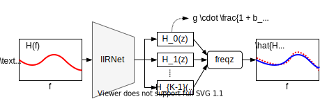

<div  align="center">

# IIRNet



Direct design of biquad filter cascades with neural networks by sampling random polynomials.

[[PDF]()]

</div>

## Usage

```bash
git clone https://github.com/csteinmetz1/IIRNet.git
pip install -r requirements.txt
./train_full.sh # train all models
```

Note: Requires PyTorch >=1.8

## Filter methods 

| ID  | Sampling method        | Name                  | 
| --- | ---------------------- | --------------------- |
| (A) | Normal coefficients    |  `normal_poly`        |
| (B) | Normal biquads         |  `normal_biquad`      |
| (C) | Uniform disk           |  `uniform_disk`       |
| (D) | Uniform magnitude disk |  `uniform_mag_disk`   |
| (E) | Characteristic         |  `char_poly`          |
| (F) | Uniform parametric     |  `uniform_parametric` |