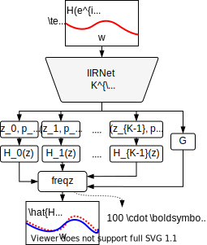

<div  align="center">

# IIRNet



Direct design of biquad filter cascades with neural networks by sampling random polynomials.

[[PDF]()]

</div>

## Usage

```bash
git clone https://github.com/csteinmetz1/IIRNet.git
pip install .
```

### Filter design 

### Training

We provide a set of shell scripts that will launch training jobs 
that reproduce the experiments from the paper in `configs/`.
These should be launched from the top level after installing. 

### Evaluation
Running the evaluation will require both the pre-trained models (or models you trained yourself)
along with the HRTF and Guitar cabinet datasets. 
These datasets can be downloaded as follows:

First, change to the data directory and then run the download script.
```
cd data
./dl.sh
```

Note, you may need to install 7z if you don't already have it. 
```brew install p7zip``` on macOS

Next download the pre-trained checkpoints if you haven't already.

```
wget link/to/zenodo
unzip logs.zip
```

Now you can run the evaluation on checkpoints from the three different experiments as follows.

```
python eval.py logs/filter_method --yw --sgd --guitar_cab --hrtf --filter_order 16
python eval.py logs/hidden_dim --yw --sgd --guitar_cab --hrtf --filter_order 16
```

For the filter order experiment we need to run the eval script across all models for every order.
```
python eval.py logs/filter_order --guitar_cab --hrtf --filter_order 4
python eval.py logs/filter_order --guitar_cab --hrtf --filter_order 8
python eval.py logs/filter_order --guitar_cab --hrtf --filter_order 16
python eval.py logs/filter_order --guitar_cab --hrtf --filter_order 32
python eval.py logs/filter_order --guitar_cab --hrtf --filter_order 64
```

Note: Requires PyTorch >=1.8

## Filter methods 

| ID  | Sampling method        | Name                  | 
| --- | ---------------------- | --------------------- |
| (A) | Normal coefficients    |  `normal_poly`        |
| (B) | Normal biquads         |  `normal_biquad`      |
| (C) | Uniform disk           |  `uniform_disk`       |
| (D) | Uniform magnitude disk |  `uniform_mag_disk`   |
| (E) | Characteristic         |  `char_poly`          |
| (F) | Uniform parametric     |  `uniform_parametric` |