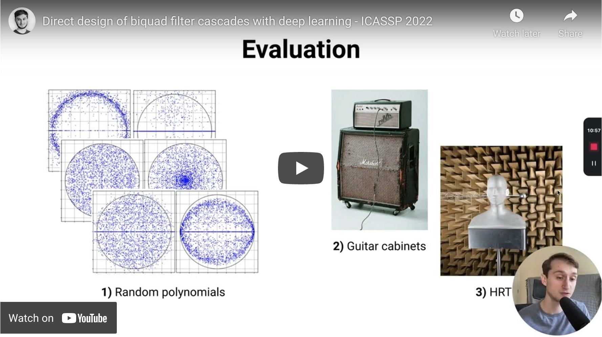
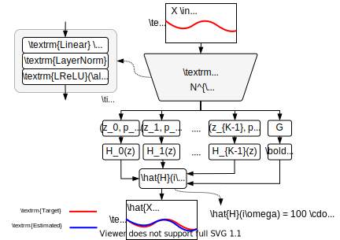
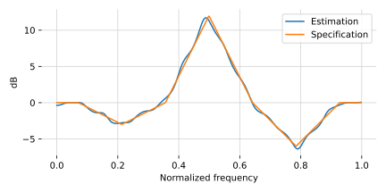

<div  align="center">

# IIRNet
Direct design of biquad filter cascades with deep learning by sampling random polynomials.

[](https://opensource.org/licenses/Apache-2.0)
[](https://colab.research.google.com/github/csteinmetz1/IIRNet/blob/main/demos/demo.ipynb)
[](https://arxiv.org/abs/2110.03691)

<a href="https://www.youtube.com/watch?v=B_fRxHZMJ9k" target="_blank"></a>

Click here to watch the paper video explanation.


</div>


## Citation

If you use any of our code in your work please consider citing us.

```
  @inproceedings{colonel2021iirnet,
    title={Direct design of biquad filter cascades with deep learning by sampling random polynomials},
    author={Colonel, Joseph and Steinmetz, Christian J. and Michelen, Marcus and Reiss, Joshua D.},
    booktitle={ICASSP},
    year={2022}}
```

## Usage

```bash
git clone https://github.com/csteinmetz1/IIRNet.git
cd IIRNet
pip install -e .
```

### Filter design 

Start designing filters with just a few lines of code. 
In this example ([`demos/basic.py`](demos/basic.py) ) we create a 32nd order IIR filter 
to match an arbitrary response that we define over a few points. 
Internally, this specification will be interpolated to 512 points. 


<div align="center">

</div>

```Python
import torch
import numpy as np
import scipy.signal
import matplotlib.pyplot as plt
from iirnet.designer import Designer

# first load IIRNet with pre-trained weights
designer = Designer()

n = 32  # Desired filter order (4, 8, 16, 32, 64)
m = [0, -3, 0, 12, 0, -6, 0]  # Magnitude response specification
mode = "linear"  # interpolation mode for specification
output = "sos"  # Output type ("sos", or "ba")

# now call the designer with parameters
sos = designer(n, m, mode=mode, output=output)

# measure and plot the response
w, h = scipy.signal.sosfreqz(sos.numpy(), fs=2)

# interpolate the target for plotting
m_int = torch.tensor(m).view(1, 1, -1).float()
m_int = torch.nn.functional.interpolate(m_int, 512, mode=mode)

fig, ax = plt.subplots(figsize=(6, 3))
plt.plot(w, 20 * np.log10(np.abs(h)), label="Estimation")
plt.plot(w, m_int.view(-1), label="Specification")
# .... more plotting ....
```



See [`demos/basic.py`](demos/basic.py) for the full script.

### Training

We provide a set of shell scripts that will launch training jobs 
that reproduce the experiments from the paper in `configs/`.
These should be launched from the top level after installing. 

```Bash
./configs/train_hidden_dim.sh
./configs/filter_method.sh
./configs/filter_order.sh
```

### Evaluation
Running the evaluation will require both the pre-trained models (or models you trained yourself)
along with the HRTF and Guitar cabinet datasets. 
These datasets can be downloaded as follows:

First, change to the data directory and then run the download script.
```
cd data
./dl.sh
```

Note, you may need to install 7z if you don't already have it. 
```brew install p7zip``` on macOS

Next download the pre-trained checkpoints if you haven't already.

```
mkdir logs
cd logs 
wget https://zenodo.org/record/5550275/files/filter_method.zip
wget https://zenodo.org/record/5550275/files/filter_order.zip
wget https://zenodo.org/record/5550275/files/hidden_dim.zip

unzip filter_method.zip
unzip filter_order.zip
unzip hidden_dim.zip

rm filter_method.zip
rm filter_order.zip
rm hidden_dim.zip
```

Now you can run the evaluation on checkpoints from the three different experiments as follows.

```
python eval.py logs/filter_method --yw --sgd --guitar_cab --hrtf --filter_order 16
python eval.py logs/hidden_dim --yw --sgd --guitar_cab --hrtf --filter_order 16
```

For the filter order experiment we need to run the eval script across all models for every order.
```
python eval.py logs/filter_order --guitar_cab --hrtf --filter_order 4
python eval.py logs/filter_order --guitar_cab --hrtf --filter_order 8
python eval.py logs/filter_order --guitar_cab --hrtf --filter_order 16
python eval.py logs/filter_order --guitar_cab --hrtf --filter_order 32
python eval.py logs/filter_order --guitar_cab --hrtf --filter_order 64
```

Note: Requires PyTorch >=1.8

## Filter methods 

| ID  | Sampling method        | Name                  | 
| --- | ---------------------- | --------------------- |
| (A) | Normal coefficients    |  `normal_poly`        |
| (B) | Normal biquads         |  `normal_biquad`      |
| (C) | Uniform disk           |  `uniform_disk`       |
| (D) | Uniform magnitude disk |  `uniform_mag_disk`   |
| (E) | Characteristic         |  `char_poly`          |
| (F) | Uniform parametric     |  `uniform_parametric` |
